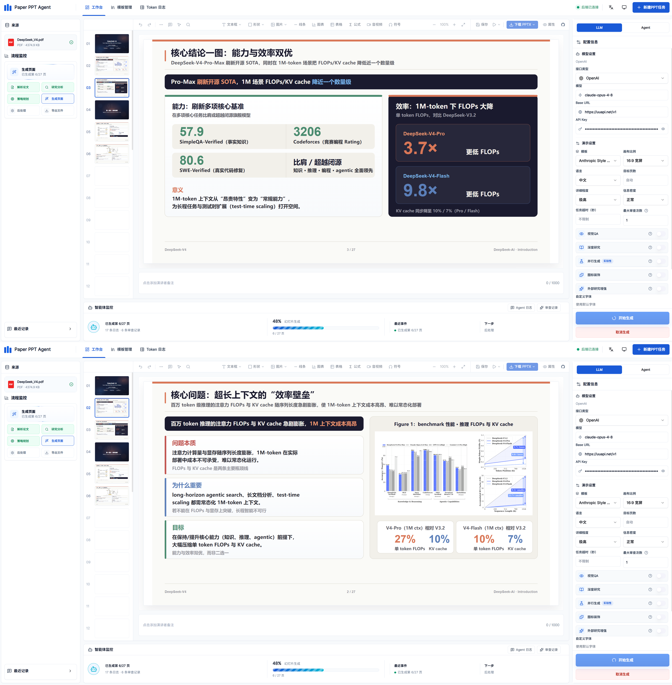
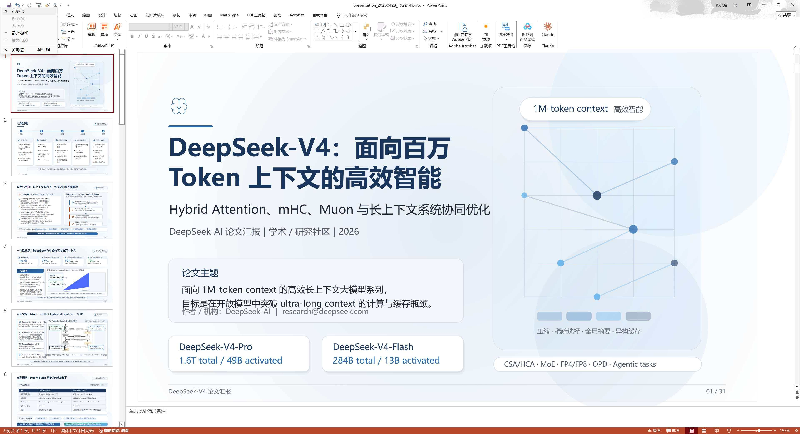

# Paper PPT Agent

<p align="center">
  <b>Upload a paper, AI generates your presentation</b>
</p>

<p align="center">
  <a href="./LICENSE"></a>
  
  
  
  
  
</p>

<p align="center">
  <a href="./README.md">中文</a> | English
</p>

---

A multi-agent pipeline for automatically generating editable PowerPoint presentations from academic papers. Upload a PDF or TeX source, and the AI handles content extraction, structural planning, layout design, and visual quality assurance.



## Table of Contents

- [✨ Features](#-features)
- [📸 Demo](#-demo)
- [⚙️ Requirements](#️-requirements)
- [🚀 Quick Start](#-quick-start)
- [📋 Changelog](#-changelog)
- [🙏 Acknowledgements](#-acknowledgements)
- [📄 License](#-license)

---

## ✨ Features

| Feature | Description |
|:--------|:------------|
| **Multi-Agent Pipeline** | Strategist → Executor → Critic three-stage collaboration for content extraction and layout generation |
| **Agent Generation Mode** | The workbench supports local Claude Code / Codex runtimes for presentation generation |
| **Static + Visual QA** | Automatically detects text overflow, element overlap, low contrast, and triggers repair |
| **Icon Semantic Matching** | RAG semantic search via Gemini Embedding to automatically match icons to slide content |
| **Feedback Iteration** | Targeted or full regeneration with structural changes (insert, remove, reorder) and version snapshots |
| **Real-time Observability** | Agent log stream, Token usage aggregation, per-page Critic detail panel |
| **Multi-language** | Chinese, English, bilingual, and custom language output |
| **Multi-model** | OpenAI / Anthropic / Gemini / DeepSeek and custom-compatible APIs |
| **Template Import** | Import PPTX files directly as five-page templates, or use the Claude Code Agent mode for automated analysis, templateization, and preview |
| **PPT Editor** | Built-in PPTist-based visual editor for editing generated decks and imported templates, including slides, notes, fonts, saving, and re-export |
| **Deep Research** | External research enrichment (arXiv / Semantic Scholar / Web) with relevance filtering |

## 📸 Demo

<p align="center">
  
</p>

## ⚙️ Requirements

| Dependency | Version |
|:-----------|:--------|
| 🐍 Python | 3.11+ |
| 📦 [uv](https://docs.astral.sh/uv/) | latest |
| 🟢 Node.js | 18+ |

An API key for at least one model provider: OpenAI / Anthropic / Gemini / DeepSeek or a custom BaseURL-compatible API.

Optional: workbench Agent generation requires Claude Code or Codex to be installed and configured locally. Template-import Agent mode currently uses Claude Code and requires it to be installed and configured locally.

## 🚀 Quick Start

```bash
# Clone the repository
git clone https://github.com/CRui5in/paper-ppt-agent.git
cd paper-ppt-agent

# One-click start (auto-installs deps + launches frontend & backend)
# Windows
.\start-dev.bat
# Linux
sh start-dev.sh
```

After starting: Frontend [http://127.0.0.1:5173](http://127.0.0.1:5173) · Backend [http://127.0.0.1:8000](http://127.0.0.1:8000)

<details>
<summary>📎 Manual start</summary>

```bash
# Install dependencies
uv sync --locked
cd frontend && npm install && cd ..

# Backend
uv run python -m uvicorn backend.app:app --host 127.0.0.1 --port 8000 --reload --reload-dir backend

# Frontend
cd frontend && npm run dev -- --host 127.0.0.1 --port 5173 --strictPort
```

</details>

---

## 📋 Changelog

### June 2026

- Enhanced paper parsing, section planning, and content filtering
- Improved accuracy of body figures and page image matching
- Refined table of contents and section division for better report structure
- Improved Provider and Agent generation stability
- Refined SVG repair, preview parsing, and generation status feedback
- 🧩 **Template Import Codex Support**
- 🚀 **Interactive Launcher**

### May 2026

- 🧠 **DeepSeek Provider** — Dedicated DeepSeek provider support with thinking mode configuration
- 👁️ **Visual QA (Experimental)** — Multimodal LLM renders slides as images for layout and contrast review
- 🖥️ **Real-time SVG Preview + Log Panel + Critic Detail View** — Live slide preview, Agent logs, and review details during generation
- 🎯 **Icon RAG Semantic Search** — Gemini Embedding-based semantic search for icon candidates, independently toggleable
- 🎨 **Template System & Custom Fonts** — Pre-built industry-style templates with custom heading/body font configuration
- 🧩 **Template Import** — PPTX direct import, five-page template mapping, and Claude Code Agent mode for automated template analysis and templateization
- 🤖 **Agent Generation Mode** — Integrated Claude Code / Codex presentation generation in the workbench
- 📝 **PPT Editor** — Visual PPT editor integrated into generated results and template-import workflows, with slide editing, notes, saving, and re-export
- 🔬 **Deep Research Workflow** — External research enrichment (arXiv / Semantic Scholar / Web) with relevance filtering
- 🖼️ **Online Image Search** — Search for images online using Tavily / SerpAPI, with AI layout analysis, one-click undo, and download
- 🎨 **UI Refactor** — Rewrote UI with Konva canvas editor and upgraded SVG-to-PPTX converter

### April 2026

- 🔒 **Static Critic Enhancements** — Decorative-line occlusion detection, low-contrast text detection, multi-line text width estimation fix
- 📁 **Version History Management** — Automatic snapshot archival per feedback iteration with comparison and rollback
- 🔎 **Token Log Filtering** — Filter LLM calls by model, stage, page, and job with click-to-expand detail view
- ⏹️ **Generation Cancellation** — Cancel a running pipeline mid-execution
- 🤖 **Multi-Agent Pipeline** — Strategist → Executor → Critic three-stage collaboration with automatic SVG repair and feedback iteration

---

## 🙏 Acknowledgements

- [PPTAgent](https://github.com/icip-cas/PPTAgent) — Pipeline design and Agent architecture reference
- [ppt-master](https://github.com/hugohe3/ppt-master) — Parts of the engineering approach reference
- [PPTist](https://github.com/pipipi-pikachu/PPTist) — PPT editor reference and integration foundation. Thanks to the pipipi-pikachu/PPTist project.

## ⭐ Star History

<a href="https://www.star-history.com/?repos=CRui5in%2Fpaper-ppt-agent&type=date&legend=top-left">
  <picture>
    <source media="(prefers-color-scheme: dark)" srcset="https://api.star-history.com/chart?repos=CRui5in/paper-ppt-agent&type=date&theme=dark&legend=top-left" />
    <source media="(prefers-color-scheme: light)" srcset="https://api.star-history.com/chart?repos=CRui5in/paper-ppt-agent&type=date&legend=top-left" />
    
  </picture>
</a>

## 📄 License

Released under the [GNU Affero General Public License v3.0 (AGPL-3.0)](./LICENSE).

## 📬 Contact

- 💬 GitHub Issues: [CRui5in/paper-ppt-agent/issues](https://github.com/CRui5in/paper-ppt-agent/issues)
- 📧 Email: qinruoxuan2018@gmail.com
